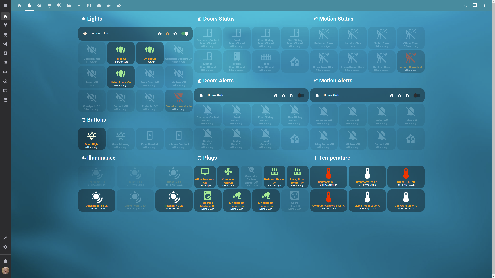
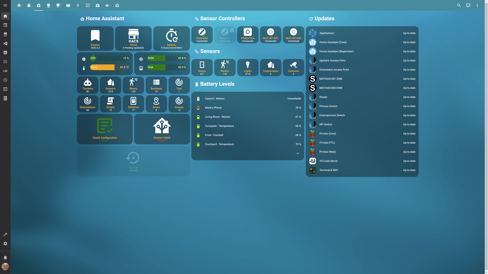
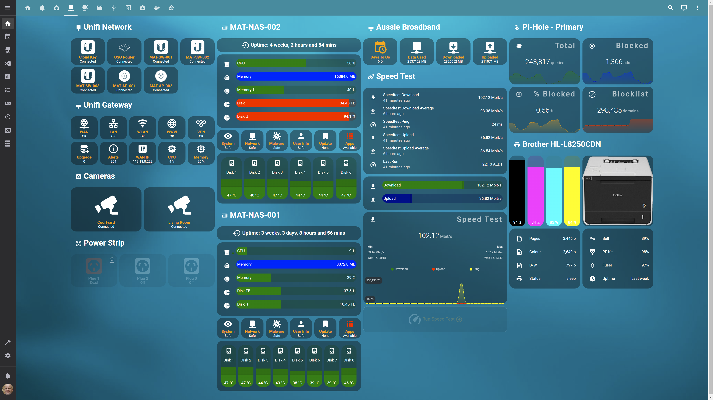
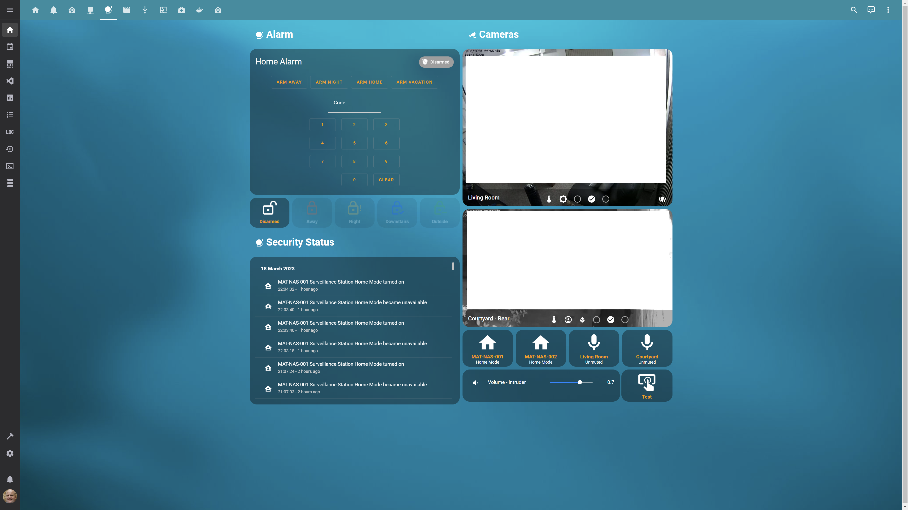
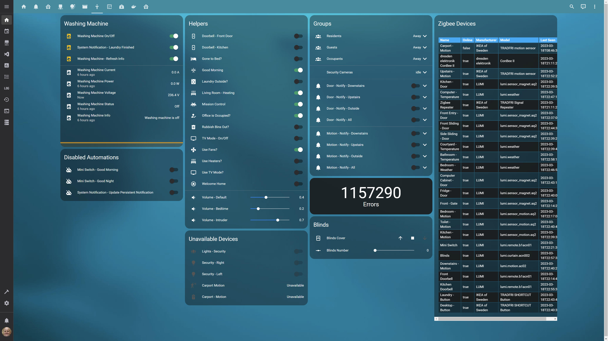
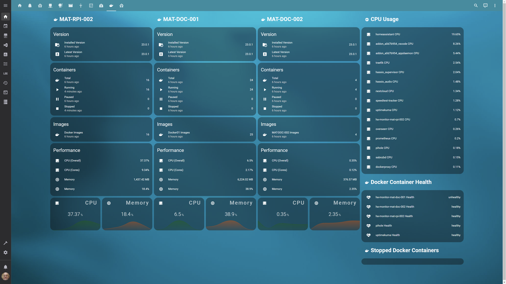
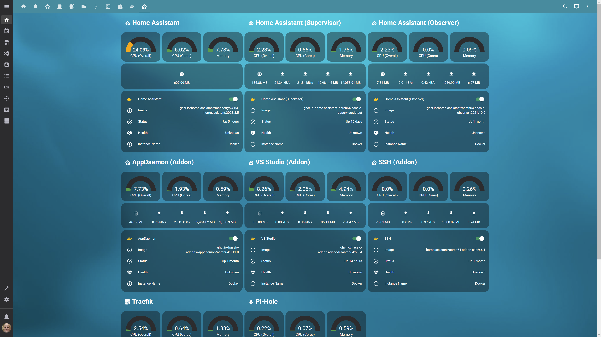

<!-- Improved compatibility of back to top link: See: https://github.com/othneildrew/Best-README-Template/pull/73 -->
<a name="readme-top"></a>
<!--
*** Thanks for checking out the Best-README-Template. If you have a suggestion
*** that would make this better, please fork the repo and create a pull request
*** or simply open an issue with the tag "enhancement".
*** Don't forget to give the project a star!
*** Thanks again! Now go create something AMAZING! :D
-->


<!-- PROJECT LOGO -->
<h3>Matho's Home Assistant Configuration</h3>
<h4>Documenting my Home Assistant configuration</h4>
<div>
  <a href="https://github.com/nzrunner/home-assistant">
    
  </a>

<!-- PROJECT SHIELDS -->
<!--
*** I'm using markdown "reference style" links for readability.
*** Reference links are enclosed in brackets [ ] instead of parentheses ( ).
*** See the bottom of this document for the declaration of the reference variables
*** for contributors-url, forks-url, etc. This is an optional, concise syntax you may use.
*** https://www.markdownguide.org/basic-syntax/#reference-style-links
-->
[![Contributors][contributors-shield]][contributors-url]
[![Forks][forks-shield]][forks-url]
[![Stargazers][stars-shield]][stars-url]
[![Bugs][bugs-shield]][bugs-url]
[![Feature Requests][features-shield]][features-url]
[![MIT License][license-shield]][license-url]
<br/>

![Project Maintenance][maintenance-shield]
[![GitHub Activity][commits-shield]][commits]
[![GitHub Last Commit][last-commit-shield]][commits]
<!--
[![LinkedIn][linkedin-shield]][linkedin-url]
-->


<!-- PROJECT SHORT DESCRIPTION AND MENU -->
  <p>
    <br />
    <a href="https://github.com/nzrunner/home-assistant"><strong>Explore the docs »</strong></a>
    <br />
    <br />
    <a href="https://github.com/nzrunner/home-assistant/issues?q=is%3Aopen+is%3Aissue+label%3Abug">Report Bug</a>
    ·
    <a href="https://github.com/nzrunner/home-assistant/issues?q=is%3Aopen+is%3Aissue+label%3Aenhancement">Request Feature</a>
    .
    <a href="/docs/git-guide.md">Git Guide</a>
  </p>
</div>


<!-- TABLE OF CONTENTS -->
<details>
  <summary>Table of Contents</summary>
  <ol>
    <li>
      <a href="#about-the-project">About The Project</a>
      <ul>
        <li><a href="#built-with">Built With</a></li>
        <li><a href="#integrations">Integrations</a></li>
        <li><a href="#custom-components">Custom Components</a></li>
        <li><a href="#devices">Devices</a></li>
      </ul>
    </li>
    <!--
    <li>
      <a href="#getting-started">Getting Started</a>
      <ul>
        <li><a href="#prerequisites">Prerequisites</a></li>
        <li><a href="#installation">Installation</a></li>
      </ul>
    </li>
    <li><a href="#usage">Usage</a></li>
    -->
    <li><a href="#roadmap">Roadmap</a></li>
    <li><a href="#contributing">Contributing</a></li>
    <li><a href="#license">License</a></li>
    <li><a href="#contact">Contact</a></li>
    <li><a href="#acknowledgments">Acknowledgments</a></li>
  </ol>
</details>


<!-- ABOUT THE PROJECT -->
## About The Project

Home Assistant (https://homeassistant.io) is an awesome open-source home automation product that I have deployed to run my house.

I created this project to: -

<ul>
<li>Have a backup of my configuration</li>
<li>Contribute to the open-source community</li>
</ul>

As I continue to make improvements to my smart home, I will be updating my configuration regularly. Be sure to ⭐ my page and stay tuned for the latest updates.

Hopefully, as I have learned from others and "borrowed" sectons of their code, others can benefit from my configuration.

Sadly, I didn't keep a good record of the initial Home Assistant configurations that inspired me. If I stumble over them again, I will add them to the acknowledgements section.

### Primary Dashboard
[![Product Name Screen Shot][product-screenshot]](images/home-assistant.png)
### Alerts Dashboard

### System Dashboard

### Network Dashboard

### Security Dashboard

### Entertainment Dashboard

### Debugging Dashboard

### Docker Server Dashboard

### Docker Containers Dashboard


<p align="right">(<a href="#readme-top">back to top</a>)</p>


### Built With

[![Home Assistant][Hass.io]][Hass-url]
<!--
* [![React][React.js]][React-url]
* [![Vue][Vue.js]][Vue-url]
* [![Angular][Angular.io]][Angular-url]
* [![Svelte][Svelte.dev]][Svelte-url]
* [![Laravel][Laravel.com]][Laravel-url]
* [![Bootstrap][Bootstrap.com]][Bootstrap-url]
* [![JQuery][JQuery.com]][JQuery-url]
-->
<p align="right">(<a href="#readme-top">back to top</a>)</p>

### Integrations
<ul>
  <li>Apple iCloud</li>
  <li>Apple TV</li>
  <li>Brother Printer</li>
  <li>Sony Bravia TV</li>
  <li>HD HomeRun DMS</li>
  <li>My IP</li>
  <li>Google Cast</li>
  <li>Home Assistant Supervisor</li>
  <li>HomeKit</li>
  <li>Local IP</li>
  <li>Mobile App</li>
  <li>Philips Hue</li>
  <li>Pi-Hole</li>
  <li>Plex Media Server</li>
  <li>Radarr</li>
  <li>SABnzbd</li>
  <li>Season</li>
  <li>Sonarr</li>
  <li>Sonos</li>
  <li>SpeedTest</li>
  <li>Sun</li>
  <li>Synology DSM</li>
  <li>Tautulli</li>
  <li>TP-Link Kasa Smart</li>
  <li>Unifi Network</li>
  <li>Uptime</li>
  <li>CONBEE II (Zigbee Home Automation)</li>
</ul>

<p align="right">(<a href="#readme-top">back to top</a>)</p>

### Custom Components
#### Integrations
<ul>
  <li>HACS</li>
  <li>Unifi Gateway</li>
  <li>Auto Backup</li>
  <li>Local Tuya</li>
  <li>FontAwesome</li>
  <li>Browser_Mod</li>
  <li>Monitor Docker</li>
  <li>SimpleIcons</li>
  <li>Garbage Collection</li>
  <li>Radaarr Upcoming Media</li>
  <li>Sonarr Upcoming Media</li>
  <li>Bereau of Meteorology</li>
  <li>Plex Recently Added</li>
  <li>Average Sensor</li>
  <li>Garmin Connect</li>
  <li>ICS Calendar (iCalendar)</li>
  <li>Uptime Kuma</li>
  <li>Medisafe</li>
</ul>

#### Frontend
<ul>
  <li>Multiple-Entity-Row</li>
  <li>Bar Card</li>
  <li>Button-Card</li>
  <li>Decluttering Card</li>
  <li>ZHA Network Card</li>
  <li>Text Divider Row</li>
  <li>Mini Media Player</li>
  <li>Auto-Entities</li>
  <li>Card-Mod</li>
  <li>Fold-Entity-Row</li>
  <li>Slider-Entity-Row</li>
  <li>Template-Entity-Row</li>
  <li>IOS Themes - Dark Mode and Light Mode</li>
  <li>Custom Brand Icons</li>
  <li>Digital Clock</li>
  <li>BigNumber-Card</li>
  <li>Battery State Card</li>
  <li>Hass Hue Icons</li>
  <li>BOM Radar Card</li>
  <li>Platinum Weather Card</li>
</ul>

#### Automation
<ul>
  <li>Config Check</li>
</ul>

#### Addons
<ul>
  <li>VS Code</li>
  <li>Terminal and SSH</li>
</ul>

<p align="right">(<a href="#readme-top">back to top</a>)</p>

### Devices
#### Network
<ul>
  <li>Ubiquiti Unifi USG 3 Router (https://ui.com/consoles)</li>
  <li>Ubiquiti Unifi AP Lite (https://ui.com/wi-fi)</li>
  <li>Ubiquiti Unifi Switches (https://ui.com/switching)</li>
  <li>Ubiquiti Unifi Cloud Key GEN 1 (https://ui.com/consoles)</li>
  <li>Brother L8250CDN Printer</li>
  <li>Synology DS1812+ NAS</li>
  <li>Synology DS1618+ NAS</li>
  <li>Sonos One Speakers (https://www.sonos.com/en-au/shop/one-sl)</li>
  <li>Google Home Mini Speakers (https://store.google.com/product/google_nest_mini?hl=en-AU)</li>
  <li>Apple iPhone (https://www.apple.com/au/iphone/)</li>
  <li>Apple iPad (https://www.apple.com/au/ipad/)</li>
</ul>

#### IOT
<ul>
  <li>Aqara Motion Sensors</li>
  <li>Aqara Door Sensors</li>
  <li>Aqara Temperature Sensors</li>
  <li>Aqara Mini Switch</li>
  <li>Aqara Blind Controller</li>
  <li>Philips Hue Smart Bulbs</li>
  <li>Philips Hue Motion Sensors</li>
  <li>Philips Hue Dimmer Switch</li>
  <li>IKEA Tradfri Motion Sensors</li>
  <li>IKEA Tradfri Buttons</li>
  <li>IKEA Tradfri Smart Bulbs</li>
  <li>Arlec Smart Plugs</li>
  <li>TP-Link HS110 Smart Plug</li>
  <li>TP-Link KP303 Smart Powerboard</li>
  <li>Security Cameras (x 2)</li>
</ul>

<p align="right">(<a href="#readme-top">back to top</a>)</p>


<!-- GETTING STARTED -->
<!--
## Getting Started

This is an example of how you may give instructions on setting up your project locally.
To get a local copy up and running follow these simple example steps.

### Prerequisites

This is an example of how to list things you need to use the software and how to install them.
* npm
  ```sh
  npm install npm@latest -g
  ```

### Installation

1. Get a free API Key at [https://example.com](https://example.com)
2. Clone the repo
   ```sh
   git clone https://github.com/nzrunner/home-assistant.git
   ```
3. Install NPM packages
   ```sh
   npm install
   ```
4. Enter your API in `config.js`
   ```js
   const API_KEY = 'ENTER YOUR API';
   ```

<p align="right">(<a href="#readme-top">back to top</a>)</p>


-->
<!-- USAGE EXAMPLES -->
<!--
## Usage

Use this space to show useful examples of how a project can be used. Additional screenshots, code examples and demos work well in this space. You may also link to more resources.

_For more examples, please refer to the [Documentation](https://example.com)_

<p align="right">(<a href="#readme-top">back to top</a>)</p>


-->
<!-- ROADMAP -->
## Roadmap

- [ ] Review project files for items that should be in the secrets.yaml file
- [x] Disable Bluetooth Tracker
- [ ] Update the README
  - [ ] Complete Integrations list (with links)
  - [ ] Complete Custom Components section (with links)
  - [x] Improve the content in the About The Project section
  - [x] Update the Roadmap section
  - [ ] Add a Devices section (with links)
    - [ ] IoT devices
    - [x] Other devices
  - [ ] Update Built-With section, describing the hardware and OS configuration
- [x] Logo
  - [x] Use a file stored in the project
  - [x] Design a project specific image (Canva)
- [ ] Add Roadmap items as Feature Requests in the Issues list
- [x] Add a Change Log
- [ ] Redo screenshots with preferred theme colour
- [x] Write a Git Guide
- [x] Adopt a git commit message convention
- [ ] Publish the lovelace-ui.yaml

See the [open issues](https://github.com/nzrunner/home-assistant/issues) for a full list of proposed features (and known issues).

<p align="right">(<a href="#readme-top">back to top</a>)</p>


<!-- CONTRIBUTING -->
## Contributing

Contributions are what make the open source community such an amazing place to learn, inspire, and create. Any contributions you make are **greatly appreciated**.

If you have a suggestion that would make this better, please fork the repo and create a pull request. You can also simply open an issue with the tag "enhancement".
Don't forget to give the project a star! Thanks again!

1. Fork the Project
2. Create your Feature Branch (`git checkout -b feature/AmazingFeature`)
3. Commit your Changes (`git commit -m 'Add some AmazingFeature'`)
4. Push to the Branch (`git push origin feature/AmazingFeature`)
5. Open a Pull Request

<p align="right">(<a href="#readme-top">back to top</a>)</p>


<!-- LICENSE -->
## License

Distributed under the MIT License. See `LICENSE.txt` for more information.

<p align="right">(<a href="#readme-top">back to top</a>)</p>


<!-- CONTACT -->
## Contact

<ul>
<li>Mark Matheson - [@nzrunner](https://twitter.com/nzrunner)</li>
<li>Project Link: https://github.com/nzrunner/home-assistant</li>
</ul>

<p align="right">(<a href="#readme-top">back to top</a>)</p>


<!-- ACKNOWLEDGMENTS -->
## Acknowledgments

### Home Assistant
<ul>
<li>IOS Theme - The theme I use (https://github.com/basnijholt/lovelace-ios-themes/)</li>
<li>A really well documented Home Assistant configuration (https://github.com/basnijholt/home-assistant-config)</li>
<li>Swakes - Home Assistant gave me some design inspiration (https://github.com/pqpxo/SWAKES_hassio)</li>
<li>Metbril's Home Assistant Configuration - Review Github workflow actions (https://github.com/metbril/home-assistant-config)</li>
<li>Good source for Lovelace CCS variables, particularly colors (https://github.com/chipriley/lovelace-css-values/blob/master/known_css_refs.md)</li>
</ul>

### General
<ul>
<li>A great tool for generating funky text file headers (https://patorjk.com/software/taag/#p=display&c=bash&f=Standard&t=configuration)</li>
<li>Making cool shields (https://shields.io/)</li>
</ul>

<p align="right">(<a href="#readme-top">back to top</a>)</p>


<!-- MARKDOWN LINKS & IMAGES -->
<!-- https://www.markdownguide.org/basic-syntax/#reference-style-links -->
[contributors-shield]: https://img.shields.io/github/contributors/nzrunner/home-assistant.svg?style=for-the-badge
[contributors-url]: https://github.com/nzrunner/home-assistant/graphs/contributors
[forks-shield]: https://img.shields.io/github/forks/nzrunner/home-assistant.svg?style=for-the-badge
[forks-url]: https://github.com/nzrunner/home-assistant/network/members
[stars-shield]: https://img.shields.io/github/stars/nzrunner/home-assistant.svg?style=for-the-badge
[stars-url]: https://github.com/nzrunner/home-assistant/stargazers
[bugs-shield]: https://img.shields.io/github/issues-search/nzrunner/home-assistant?style=for-the-badge&label=Bugs&query=is%3Aopen%20is%3Aissue%20label%3Abug
[bugs-url]: https://github.com/nzrunner/home-assistant/issues?q=is%3Aopen+is%3Aissue+label%3Abug
[features-shield]: https://img.shields.io/github/issues-search/nzrunner/home-assistant?style=for-the-badge&label=Feature%20Requests&query=is%3Aopen%20is%3Aissue%20label%3Aenhancement
[features-url]: https://github.com/nzrunner/home-assistant/issues?q=is%3Aopen+is%3Aissue+label%3Aenhancement
[license-shield]: https://img.shields.io/github/license/nzrunner/home-assistant.svg?style=for-the-badge
[license-url]: https://github.com/nzrunner/home-assistant/blob/master/LICENSE.txt
[maintenance-shield]: https://img.shields.io/maintenance/yes/2023.svg
[commits-shield]: https://img.shields.io/github/commit-activity/y/nzrunner/home-assistant.svg
[commits]: https://github.com/nzrunner/home-assistant/commits/master
[last-commit-shield]: https://img.shields.io/github/last-commit/nzrunner/home-assistant.svg
[product-screenshot]: images/home-assistant.png
[Hass.io]: https://img.shields.io/badge/Home%20Assistant-blue?style=for-the-badge&logo=home-assistant&logoColor=#41BDF5
[Hass-url]: https://www.home-assistant.io/
<!--
[linkedin-shield]: https://img.shields.io/badge/-LinkedIn-black.svg?style=for-the-badge&logo=linkedin&colorB=555
[linkedin-url]: https://linkedin.com/in/nzrunner
[React.js]: https://img.shields.io/badge/React-20232A?style=for-the-badge&logo=react&logoColor=61DAFB
[React-url]: https://reactjs.org/
[Vue.js]: https://img.shields.io/badge/Vue.js-35495E?style=for-the-badge&logo=vuedotjs&logoColor=4FC08D
[Vue-url]: https://vuejs.org/
[Angular.io]: https://img.shields.io/badge/Angular-DD0031?style=for-the-badge&logo=angular&logoColor=white
[Angular-url]: https://angular.io/
[Svelte.dev]: https://img.shields.io/badge/Svelte-4A4A55?style=for-the-badge&logo=svelte&logoColor=FF3E00
[Svelte-url]: https://svelte.dev/
[Laravel.com]: https://img.shields.io/badge/Laravel-FF2D20?style=for-the-badge&logo=laravel&logoColor=white
[Laravel-url]: https://laravel.com
[Bootstrap.com]: https://img.shields.io/badge/Bootstrap-563D7C?style=for-the-badge&logo=bootstrap&logoColor=white
[Bootstrap-url]: https://getbootstrap.com
[JQuery.com]: https://img.shields.io/badge/jQuery-0769AD?style=for-the-badge&logo=jquery&logoColor=white
[JQuery-url]: https://jquery.com 
-->
